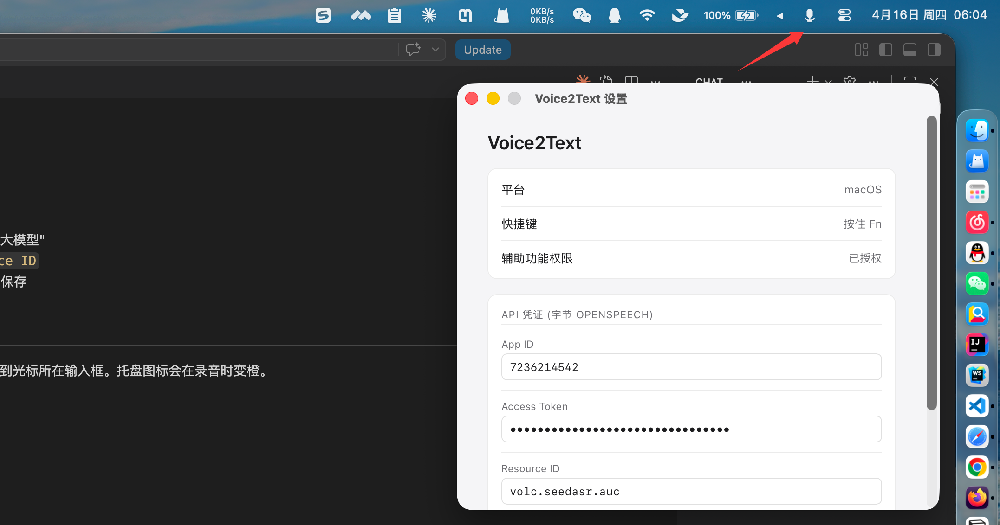

# VibeTalking

> 按住一个键说话,松开自动把语音转成文字粘到当前输入框。

跨平台菜单栏小工具 (macOS + Windows)。默认用 **Qwen3.5 Omni**(阿里云百炼 / DashScope)做语音转写,再可选地过一遍 **LLM 润色**(任意 OpenAI 兼容接口)修正同音字、术语拼写和标点。

[English](./README.en.md)



## 工作流程

```
按住快捷键 → 录音 → ASR 转写(Qwen Omni)→ 可选 LLM 润色 → 自动粘贴到光标处
```

1. **转写 (ASR)**:把录音发给所选转写后端(默认 Qwen3.5 Omni Flash),拿到原始文字。
2. **润色 (Refine,可选)**:把原始文字再发给一个 OpenAI 兼容的 chat 接口做后处理——修同音 / 误识别、保留中英混说里英文术语的原始拼写与大小写、规范数字与版本号、补标点、去掉「嗯 / 那个 / 就是说」等口头填充,但**不总结、不改写**。失败自动回退到原始文字。
3. **粘贴**:把最终文字合成 Cmd/Ctrl+V 粘到当前输入框。

## 特性

- **Push-to-talk**:按住快捷键录音,松开转写并自动粘贴到任何输入框
- **可换转写后端**:Qwen3.5 Omni Flash / Omni Plus / Qwen3 ASR Flash / 字节 OpenSpeech,设置里一键切换
- **可选 LLM 润色**:任意 OpenAI 兼容接口(base URL + model + key 自己填),让转写更干净
- **菜单栏常驻**:点击图标弹出历史 popover,半透明毛玻璃风格,失焦自动收起
- **历史记录**:保留最近 500 条,同时存原始与润色后文本,点一下复制到剪贴板
- **轻量**:原生 Tauri + Rust,不跑 Electron,内存占用小

## 快捷键

| 平台 | 按住键 |
|---|---|
| macOS | **Fn** |
| Windows | **Right Alt** |

## 安装

### macOS

1. 去 [Releases](https://github.com/Windy3f3f3f3f/vibetalking/releases) 下最新 `VibeTalking_*.dmg`
2. 打开 dmg → 把 VibeTalking 拖到 Applications
3. 从 Launchpad 启动。首次会弹两个授权:
   - **麦克风**:允许
   - **辅助功能**:系统设置 → 隐私与安全 → 辅助功能 → 勾选 VibeTalking(用于监听 Fn 键 + 合成粘贴)
4. 因为没做公证,首次启动可能被 Gatekeeper 拦,右键 App 选"打开"绕过一次即可

### Windows

1. 去 [Releases](https://github.com/Windy3f3f3f3f/vibetalking/releases) 下最新 `VibeTalking_*.msi`
2. 双击安装 → 从开始菜单启动
3. 首次录音时授权麦克风即可

## 配置

托盘图标右键 → 设置。

### 1. 转写后端 (ASR)

在「转写后端」里选模型:

| 选项 | 说明 |
|---|---|
| **Qwen3.5 Omni Flash**(默认) | 阿里云百炼多模态,快,中英混说效果好 |
| **Qwen3.5 Omni Plus** | 同系列更强档 |
| **Qwen3 ASR Flash** | 纯 ASR 模型 |
| **字节 OpenSpeech** | 旧的字节火山引擎录音识别大模型(仍保留) |

用 Qwen 系列时,在「DashScope / Qwen」卡片里填 **API Key**(阿里云百炼,[获取](https://bailian.console.aliyun.com/));Base URL 默认 `https://dashscope.aliyuncs.com/compatible-mode/v1`,也可把 key 留空、改读环境变量 `DASHSCOPE_API_KEY`。Omni Prompt 是转写时给模型的指令,可按需修改。

### 2. LLM 润色(可选)

「Refine(LLM 后处理)」卡片——这一步把任何 OpenAI 兼容的 chat completions 接口当后处理器,**用谁、用什么模型完全由你配置**:

- **启用 refine**:勾上才会在转写后再过一遍 LLM
- **Base URL / Model / API Key**:填你自己的接口即可(OpenAI、自建 vLLM、各类聚合网关……)。仓库里给的默认示例是 AIHUBMIX 的 `gpt-5.4-mini`,只是个占位,随意替换
- API Key 留空时会读环境变量 `AIHUBMIX_API_KEY` 或 `OPENAI_API_KEY`
- **Refine Prompt**:后处理提示词,可改,可一键恢复默认

### 字节 OpenSpeech(可选)

若用字节后端,在对应卡片填 App ID / Access Token / Resource ID / Language。去 [字节火山引擎语音服务](https://console.volcengine.com/speech/service/10011) 开通"录音文件识别大模型"获取凭证。

## 使用

按住快捷键 → 说话 → 松开 → 等 1~3 秒,文字自动粘到光标所在输入框。托盘图标会在录音时变橙。

菜单栏左键展开历史 popover:
- 单击条目复制到剪贴板
- 右上 × 删除单条
- 底部"清空 / 设置 / 退出"

## 从源码构建

需要 Node 18+、Rust stable、npm。

```bash
cd app
npm install
npm run tauri dev      # 开发模式
npm run tauri build    # 出安装包,产物在 src-tauri/target/release/bundle/
```

## 技术栈

- [Tauri 2](https://tauri.app/) — 应用框架
- Rust — 后端(录音、HTTP、热键、剪贴板、ASR + refine 调用)
- TypeScript + Vite — 前端(popover / 设置页)
- 转写:Qwen3.5 Omni / Qwen3 ASR(阿里云百炼 DashScope)或字节 OpenSpeech
- 润色:任意 OpenAI 兼容 LLM

跨平台共享大部分代码,只有全局热键监听和粘贴键合成需要平台分支。

## License

MIT
